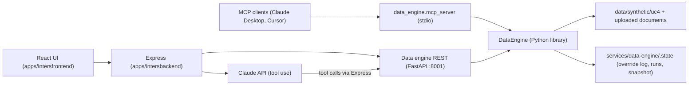

# Context: Architecture

## Area and confidence

- Area id: `architecture`
- Confidence: BASELINE

## Signals

- (BASELINE area: always included, not detected from a signal)

## What lives here

Product: "Breeder's Desk", the team's answer to Syngenta hackathon Use Case 4, R&D Data Source
Unification (`gendd/specs/uc4-use-case.md`). An assistant that unifies mock trial, operations, lab and
germplasm data and triages candidate lines red / amber / green with a stated reason, while the breeder
keeps the final call.

- Directories:
  - `apps/intersfrontend/` - React 18 + Vite user interface (port 5173).
  - `apps/intersbackend/` - Node.js + Express API (port 3000). The browser talks only to this.
  - `services/data-engine/` - Python service (FastAPI, port 8001) that ingests, unifies, scores and
    explains. It is the only component that produces numbers (`services/data-engine/docs/CONTRACTS.md`).
  - `data/synthetic/uc4/` - Syngenta mock exports, committed as fixtures (`data/synthetic/uc4/README.md`).
  - `.github/workflows/` - continuous integration (lint only).
  - `.cursor/rules/` - team coding rules for the JavaScript apps.
- Entry points:
  - Frontend: `apps/intersfrontend/src/main.jsx` -> `App.jsx` -> `pages/LandingPage.jsx`.
  - Backend: `apps/intersbackend/src/index.js` (`GET /`, `GET /health`).
  - Data engine REST: `services/data-engine/src/data_engine/api.py` (`uvicorn data_engine.api:app --port 8001`).
  - Data engine MCP server (stdio): `services/data-engine/src/data_engine/mcp_server.py`.
  - Data engine library: `DataEngine` in `services/data-engine/src/data_engine/engine.py`.
  - Evaluation report: `python -m data_engine.evaluate` (`services/data-engine/src/data_engine/evaluate.py`).

### Target runtime shape

Source: `services/data-engine/docs/INTEGRATION.md`.

Current state versus target: only the data engine is implemented. `apps/intersbackend/src/index.js`
exposes `/` and `/health` only, and `apps/intersfrontend` renders a landing page only. The Express
wiring exists as drop-in examples in `services/data-engine/clients/node/` (`dataEngineClient.js`,
`breederRoutes.example.js`, `agentLoop.example.js`, `constants.js`) that have not been copied into
`apps/intersbackend` yet.

### Data engine pipeline

Source: `services/data-engine/README.md` (Layers table) and `services/data-engine/docs/DESIGN.md`.

ingest / documents -> detect -> profile (entropy "renormalization") -> canonical model -> quality
(issues, root causes, fixes with provenance) -> rules (colour + evidence) -> spectral (atypical /
similar) -> calibrate (ambiguity, ROC) -> telemetry + diagnostics (`runs/*.json`) -> REST API / agent
tools / MCP server.

### Architectural invariants

These come from the use case's non-negotiable constraints and are enforced in code:

- The deterministic rules decide the colour. Statistics and the LLM only qualify or explain it
  (`services/data-engine/README.md`, "Design rule"; thresholds in `services/data-engine/config/rules.yaml`).
- The LLM never computes numbers; it quotes `statement` or `value` from engine payloads
  (`services/data-engine/docs/CONTRACTS.md`; system prompt in `services/data-engine/src/data_engine/agent_tools.py`).
- There is no override tool for the agent. Overrides are human-only, via `POST /overrides`, appended
  to a JSON-Lines audit log that never changes `engine_colour`
  (`services/data-engine/src/data_engine/audit.py`, `services/data-engine/docs/INTEGRATION.md` section 3).
- The system of record is never overwritten; quality fixes are recorded with provenance and the mock
  files are never modified (`data/synthetic/uc4/README.md`).
- Out of scope: any connection to a live research system (`gendd/specs/uc4-use-case.md`).

## Conventions in force

- Frontend and backend stay in separate apps; no mixing concerns in one file:
  `.cursor/rules/00-overview.mdc`.
- Constants live per app (`apps/*/src/constants/`), no shared constants package:
  `.cursor/rules/95-shared-constants.mdc`.
- One JSON error shape `{"error": {"code", "message", "field"}}` for Express and the data engine:
  `.cursor/rules/70-api-contract.mdc` and `services/data-engine/docs/CONTRACTS.md` ("Errors").
- JSON payload shapes between engine, Express, agent and UI: `services/data-engine/docs/CONTRACTS.md`.
- Rule thresholds, weights and versions are configuration, not code:
  `services/data-engine/config/rules.yaml`; source header signatures: `services/data-engine/config/sources.yaml`.
- Architecture Decision Records go to `gendd/adr/` (none written yet).

## Testing expectations

- See `context/quality-assurance.md`.

## Danger zones

- `services/data-engine/config/rules.yaml`: changing thresholds or weights changes every colour shown
  to breeders. The trial rule `SYNTH_V1_RECON_2026-09-30` is a reconstruction with a thin margin
  (4e-5, one trial on the boundary), and `UC4_MATERIAL_V0` is the team's own proposal
  (`services/data-engine/README.md`, "Honest limits"). Any change needs the evaluation report re-run
  (`python -m data_engine.evaluate`) and parity re-checked.
- `services/data-engine/docs/CONTRACTS.md` shapes: the Express routes, agent loop and UI depend on
  them. Changing a field name is a breaking change across three components.
- Adding an agent path that writes overrides or changes a colour breaks the human-in-the-loop
  constraint.
- `data/synthetic/uc4/`: tests and published findings are produced from exactly these files; editing
  them silently changes results.

## Unknowns

- Unknown: deployment target and hosting for each component (frontend, Express, Python engine) on
  `stg` and `main`.
- Unknown: which agent host the demo uses: the Claude API loop inside Express
  (`agentLoop.example.js`), an MCP client, or both.
- Unknown: whether the Express backend will proxy all engine calls, or the frontend may call the
  engine directly (the engine allows any origin via `CORSMiddleware(allow_origins=["*"])` in `api.py`).
- Unknown: a component inventory at `gendd/architecture/components.md` (referenced by the Definition
  of Ready) does not exist yet; `/gendd:gendd-brownfield` is expected to produce it.
