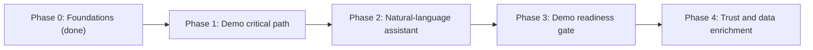

# Feature roadmap (UC4 Breeder's Desk)

Phased, priority-ordered list of the features that cover the hackathon use case
(`gendd/specs/uc4-use-case.md`), from what is already implemented to "demo ready". Scope ends at demo
readiness: conversational channels (WhatsApp, voice), authentication hardening, deployment beyond `stg`
and Cropwise packaging are out of this roadmap.

Last synced with `dev` on 2026-10-01, after PR #12 (`feature/backend-live-analysis`, merge `f08e178`).
Merged on `dev` so far for the backend gateway and Claude layer: PR #9 (API contract and paths), PR #10
and #11 (`feature/backend-core`: Supabase schema, mock/live routes, ingest service, data engine client),
PR #12 (Claude client, evidence check, live `claude:smoke`). PR #7 added the mock workspace UI. The
Step 8 explanation prompt work lives on branch `feature/backend-prompts` (not merged yet). PR #8 does not
appear in `dev`'s merge history.

## How to read and use this file

- A feature is a user-visible or system capability that one agent session can deliver and verify end
  to end.
- Setup, installs, tests, lint and pull requests are never standalone features. They are checklist
  items inside the feature that needs them.
- Each feature has 5 to 9 checklist items. More than that means the feature must be split; fewer than
  5 means it should be merged into a neighbour.
- Work the phases in order, and the features inside a phase in priority order. A feature starts only
  when everything in its "Depends on" line is done.
- Before starting a feature, turn it into a story that passes `gendd/definition-of-ready.md` and save
  it in `gendd/tickets/` (then copy it to Trello). The checklist below is the scope, not the acceptance
  criteria.
- When a pull request completes checklist items, tick them and update the feature's Status in the same
  pull request.
- Every feature must respect the use case's non-negotiables: the breeder makes the final call, every
  colour shows its reason, and the product is an assistant, not a replacement
  (`context/architecture.md`, "Architectural invariants").
- "In progress" with ticked items means part of the feature exists. For the frontend this is usually
  the UI built on mock data in `apps/intersfrontend/src/mocks/`, waiting to be wired to the API.

## Feature template

```markdown
### F<phase>.<n> <Feature name>
- Status: not started | in progress | done
- Priority: <n> of <total> in Phase <phase>
- Depends on: <feature ids or "none">
- Goal: <one or two sentences, from the breeder's or the team's perspective>
- Evidence / pointers: <files and doc sections>
- Checklist:
  - [ ] <item>
- Done when: <one line tied to the use case>
```

## Phases



| Phase | Features | Status |
|---|---|---|
| 0. Foundations | F0.1 - F0.5 | done |
| 1. Demo critical path | F1.1 - F1.5 | in progress (Express gateway in mock + partial live; UI on mocks) |
| 2. Natural-language assistant | F2.1 | in progress (Claude justification layer; chat agent pending) |
| 3. Demo readiness gate | F3.1 | not started |
| 4. Trust and data enrichment | F4.1 - F4.4 | in progress (F4.2 has mock upload UI) |

Phase 3 comes before Phase 4 on purpose: the demo must be stable before extras are added. After each
Phase 4 feature, re-run the F3.1 checklist.

---

## Phase 0 - Foundations (implemented)

### F0.1 Monorepo scaffold and team conventions
- Status: done
- Priority: 1 of 5 in Phase 0
- Depends on: none
- Goal: The team can install, run and lint the frontend and backend from one repo, following shared
  rules, and agents can load the project context.
- Evidence / pointers: `package.json`, `apps/*/package.json`, `apps/*/eslint.config.js`,
  `.github/workflows/lint.yml`, `.cursor/rules/`, `apps/intersbackend/src/index.js`, `context/`,
  `agents/`, `gendd/`.
- Checklist:
  - [x] npm workspaces for `apps/intersfrontend` (React 18 + Vite) and `apps/intersbackend` (Express)
  - [x] Root scripts `dev:frontend`, `dev:backend`, `lint`
  - [x] ESLint flat config per app; lint runs on every pull request to `dev`, `stg`, `main`
  - [x] Team rules in `.cursor/rules/` (style, naming, React, Express, API contract, testability, constants)
  - [x] Constants folders in both apps (`src/constants/`)
  - [x] Backend `GET /health` returning `{ healthy: true }` (the UI health indicator was removed in PR #7 and comes back in F1.1)
  - [x] GenDD configuration, Context Pack and role playbooks
- Done when: a new teammate can run both apps and pass lint using only `README.md`. (Met.)

### F0.2 Data ingestion and unification
- Status: done
- Priority: 2 of 5 in Phase 0
- Depends on: none
- Goal: All UC4 mock sources, plus documents, end up in one canonical model with known data problems
  reported instead of hidden.
- Evidence / pointers: `services/data-engine/src/data_engine/ingest.py`, `documents/`, `detect.py`,
  `profile.py`, `canonical.py`, `quality.py`, `config/sources.yaml`, `data/synthetic/uc4/`.
- Checklist:
  - [x] Read CSV / TSV / XLSX / JSON / Parquet tables
  - [x] Read documents (native and scanned PDF, images, DOCX, PPTX, HTML), text layer first and OCR only when needed
  - [x] Route each table to a source by header signature; unknown shapes returned as `UNKNOWN`
  - [x] Entropy-based renormalization that only drops zero-information columns
  - [x] Canonical star-schema model keyed by material and trial
  - [x] Data-quality issues with root cause, fix status and provenance; source files never modified
  - [x] Schema-drift detection against the 2026-09-28 archive drop
- Done when: the four mock sources are unified and every data issue is listed with its cause. (Met.)

### F0.3 Deterministic red / amber / green triage with evidence
- Status: done
- Priority: 3 of 5 in Phase 0
- Depends on: F0.2
- Goal: Every candidate gets a colour and a one-line reason backed by cited evidence, decided by
  readable rules rather than by a model.
- Evidence / pointers: `services/data-engine/config/rules.yaml`, `src/data_engine/rules.py`,
  `spectral.py`, `calibrate.py`, `evaluate.py`, `services/data-engine/docs/FINDINGS.md`,
  `services/data-engine/README.md` ("Results", "Honest limits").
- Checklist:
  - [x] Versioned rules and thresholds in `config/rules.yaml` (`SYNTH_V1_RECON_2026-09-30`, `UC4_MATERIAL_V0`)
  - [x] Trial verdicts with 72/72 parity against the official logic
  - [x] Candidate colour, reason and evidence items (`rule`, `field`, `value`, `threshold`, `statement`)
  - [x] Root-cause analysis for mismatches and "ambiguous" / "not explained" flags
  - [x] Spectral layer for atypical and similar candidates
  - [x] Calibrated ambiguity model, ROC versus baselines and Bayes ceiling
  - [x] Reproducible evaluation report (`python -m data_engine.evaluate`)
- Done when: each of the 150 candidates has a colour and a stated reason. (Met: 54 red, 71 amber, 25 green.)

### F0.4 Engine service interfaces and override audit log
- Status: done
- Priority: 4 of 5 in Phase 0
- Depends on: F0.3
- Goal: Other components (Express, Claude, MCP clients) can consume the engine without touching its
  internals, and breeder overrides are recorded.
- Evidence / pointers: `services/data-engine/src/data_engine/api.py`, `agent_tools.py`,
  `mcp_server.py`, `audit.py`, `telemetry.py`, `diagnostics.py`, `services/data-engine/tests/`,
  `services/data-engine/clients/node/`, `services/data-engine/docs/CONTRACTS.md`, `INTEGRATION.md`.
- Checklist:
  - [x] FastAPI REST API with the team error contract (`{"error": {"code", "message", "field"}}`)
  - [x] 9 Claude tool definitions and a system prompt served by `GET /tools`, executed by `POST /tools/{name}`
  - [x] MCP server (stdio) exposing the same tools
  - [x] Append-only override log; `engine_colour` never changed; no override tool for the agent
  - [x] Telemetry and diagnostics per run saved as JSON
  - [x] pytest suite (unit and API-level tests)
  - [x] Node client and Express route / agent-loop examples ready to copy into `apps/intersbackend`
- Done when: the engine can be called over REST and MCP, and an override is logged without changing
  the engine's colour. (Met.)

### F0.5 Breeder workspace UI prototype (mock data)
- Status: done
- Priority: 5 of 5 in Phase 0
- Depends on: F0.1
- Goal: The team can click through the whole breeder experience (upload, triage, override, chat)
  before the backend is wired, using mock data shaped like the engine's candidate row.
- Evidence / pointers: PR #7 (`ced1454`); `apps/intersfrontend/src/pages/Workspace.jsx`;
  `src/components/` (`Sidebar`, `WelcomeView`, `DashboardView`, `DashboardFilters`, `TriageSection`,
  `RowContextMenu`, `EditCandidateModal`, `ChatWidget`, `Logo`, `LeafDecoration`, `PlantDecoration`);
  `src/constants/triage.js`, `messages.js`; `src/mocks/dashboards.js`, `chatReplies.js`;
  `src/styles/theme.css`.
- Checklist:
  - [x] Workspace shell: sidebar with "New dashboard", recent dashboards and user badge
  - [x] Welcome screen with drag-and-drop / browse upload, accepted file types and file chips (no file leaves the browser)
  - [x] Dashboard with one table per colour (Approved / Conditional / Not approved), counts and empty states
  - [x] Client-side search (id, crop, justification) and status filter chips with live counts
  - [x] Expandable rows, right-click context menu and an edit modal with status change, override reason and comment
  - [x] Floating chat widget (open, minimize, close, history, typing indicator) with mock replies
  - [x] Theme, decorations and `data-testid`s on every interactive element and status message
- Done when: the full demo flow can be clicked through on mock data. (Met; wiring happens in Phases 1, 2 and 4.)

---

## Phase 1 - Demo critical path

### F1.1 Express to data engine integration
- Status: in progress
- Priority: 1 of 5 in Phase 1
- Depends on: F0.4
- Goal: The frontend can reach all breeder data through the Express backend, with the engine's errors
  and numbers passed through unchanged.
- Evidence / pointers: `docs/api-contract.md`, `apps/intersbackend/src/app.js`,
  `apps/intersbackend/src/services/dataEngineClient.js`, `apps/intersbackend/src/constants/paths.js`,
  `context/backend-development.md`, `agents/backend-dev.md`.
- Checklist:
  - [x] Data engine client and path constants in `apps/intersbackend` (from `clients/node/`, adapted)
  - [x] Gateway routes under `/api` per `docs/api-contract.md`: chats, messages (multipart upload),
    candidates (list + detail with `engine_detail`), engine passthrough (`override-reasons`, `baseline`,
    `quality`); `express.json({ limit: '25mb' })`
  - [x] `DATA_ENGINE_URL` and related timeouts in `apps/intersbackend/.env.example`
  - [x] `GET /health` reports `{ healthy, mode, engine: up|down|skipped }`
  - [x] Engine errors forwarded in the team shape; 502 `DATA_ENGINE_UNAVAILABLE` when the engine is down
  - [ ] Frontend API helper (base URL from `src/constants/api.js`, path constants, `res.ok` check) and a
    backend / engine status indicator in the workspace
  - [ ] Record backend test choice in `gendd/adr/` (`node:test` is in use with 110 tests and mocked SDK/engine)
  - [x] `npm run lint` passes
- Done when: the UI calls `GET /api/candidates` on port 3000 (mock or live) and shows whether the backend
  and engine are reachable.

### F1.2 Connect the triage dashboard to the engine
- Status: in progress (UI built on mocks in F0.5)
- Priority: 2 of 5 in Phase 1
- Depends on: F1.1
- Goal: The breeder opens a dashboard and sees the engine's real candidates with colour and a one-line
  reason, instead of mock rows.
- Evidence / pointers: `apps/intersfrontend/src/components/DashboardView.jsx`, `TriageSection.jsx`,
  `DashboardFilters.jsx`, `src/pages/Workspace.jsx`, `src/mocks/dashboards.js`,
  `docs/api-contract.md` (`GET /api/candidates`), `services/data-engine/docs/CONTRACTS.md` ("Output:
  candidate row").
- Checklist:
  - [x] Colour-grouped tables, search, status chips, counts and empty states (F0.5)
  - [ ] Replace `RECENT_DASHBOARDS` / `createMockDashboard` with `GET /api/candidates`, with visible loading and error states
  - [ ] Align columns with the contract: the engine row has no `crop` or `mean_yield_t_ha`. Either the engine exposes `mean_yield_t_ha` (from its `MEAN_YIELD_T_HA` feature) and a crop label, or the UI drops those columns. The mock data has only `CROP_GUID`, no crop name
  - [ ] Show the `ambiguous_trials` and `atypical` flags on each row
  - [ ] Decide the section order with the team (the UI shows green first; the engine sorts red first for "what to look at first")
  - [ ] Decide how "Create dashboard" and "Recent dashboards" map to the engine, which holds one dataset (for example, one dashboard = the current engine dataset, or a saved filter)
  - [ ] Choose a frontend test framework with a mentor, record it in `gendd/adr/`, and test loading, empty, error and populated states
- Done when: the breeder sees the engine's 150 candidates grouped by colour with their reasons, and can
  filter to the red ones.

### F1.3 Candidate evidence card
- Status: not started
- Priority: 3 of 5 in Phase 1
- Depends on: F1.2
- Goal: Opening a candidate shows why it got its colour, with evidence the breeder can check and
  challenge.
- Evidence / pointers: expanded row in `apps/intersfrontend/src/components/TriageSection.jsx` (today it
  only un-truncates the row), `docs/api-contract.md` (`GET /api/candidates/:id` returns `engine_detail`),
  `services/data-engine/docs/CONTRACTS.md` ("Output: evidence item").
- Checklist:
  - [ ] Expanding a row (or opening a side panel from it) fetches `GET /api/candidates/:id`
  - [ ] Header with colour, one-line reason, verdict and rule version
  - [ ] Evidence list using `evidence[].statement` exactly as returned (no recomputed numbers)
  - [ ] Trials list with `explained_by_data` and `ambiguous` flags, and data gaps (`data_gaps`) shown as such
  - [ ] Lineage from the same response, including "why parents are unavailable" (no extra route needed)
  - [ ] Loading, not-found and error states with `data-testid`s
  - [ ] Tests asserting that a colour is never rendered without its reason
- Done when: for a flagged candidate, the breeder can read a one-line explanation and the evidence behind it.

### F1.4 Breeder data corrections (engine and Express)
- Status: not started
- Priority: 4 of 5 in Phase 1
- Depends on: F1.1
- Goal: When the breeder knows a value is wrong (crop, mean yield, justification text), they can correct
  it; the correction is recorded with who, when and why, and the original data is never overwritten.
- Evidence / pointers: product decision of 2026-09-30 (`context/product-management.md`), edit fields in
  `apps/intersfrontend/src/components/EditCandidateModal.jsx`, override log pattern in
  `services/data-engine/src/data_engine/audit.py`, `api.py`, `services/data-engine/docs/CONTRACTS.md`.
- Checklist:
  - [ ] Append-only corrections log in the engine (same pattern as `audit.py`): id, timestamp, user, candidate, field (`crop`, `mean_yield_t_ha`, `reason`), original value, corrected value, comment
  - [ ] Validation: only the allowed fields; mean yield numeric and non-negative; non-empty text
  - [ ] `POST /corrections` and `GET /corrections` in `api.py`, with the team error contract
  - [ ] Candidate row and profile expose the corrected value, the original value and a `corrected` flag; `engine_colour` is not changed by a correction
  - [ ] Agent tools and the LLM context label corrected values as breeder corrections, not engine values
  - [ ] `CONTRACTS.md` documents the new endpoints and fields; Express exposes corrections when designed (not mounted yet)
  - [ ] pytest tests: correction logged, original preserved, invalid field rejected, colour unchanged
- Done when: a breeder correction to a candidate's mean yield is logged and shown next to the original
  value, and the engine's source data is unchanged.

### F1.5 Override and correction flow
- Status: in progress (modal built on mocks in F0.5)
- Priority: 5 of 5 in Phase 1
- Depends on: F1.3, F1.4
- Goal: The breeder can disagree with a colour or correct a value, say why, and see that the decision
  was recorded without the engine's recommendation being erased.
- Evidence / pointers: `apps/intersfrontend/src/components/EditCandidateModal.jsx`, `RowContextMenu.jsx`,
  `TriageSection.jsx` (overridden badge), `src/constants/triage.js` (`OVERRIDE_REASONS`),
  `services/data-engine/src/data_engine/audit.py`, `CONTRACTS.md` ("Override").
- Checklist:
  - [x] Edit modal from the row context menu with status change, reason required when the status changes, comment, and an "Overridden" badge (F0.5)
  - [ ] Load reasons from `GET /api/engine/override-reasons` instead of the hardcoded `OVERRIDE_REASONS`
  - [ ] Comment required when the reason is `OTHER` (the engine rejects it otherwise; the UI says "optional")
  - [ ] Save sends a colour change via `PATCH /api/candidates/:id` (forwards to engine `POST /overrides`) and records reviews in Supabase; field edits per F1.4 when available
  - [ ] Table and card show `engine_colour` next to `colour` when overridden, and original next to corrected values
  - [ ] Real breeder name instead of `MOCK_USER`; override and correction history visible per candidate
  - [ ] Tests: override accepted, `OTHER` without comment rejected, engine colour unchanged, correction shown beside the original
- Done when: the use case's demo-ready definition is met - a flagged candidate with a one-line
  explanation that the breeder challenges and overrides, and the override is logged.

---

## Phase 2 - Natural-language assistant

### F2.1 Breeder assistant chat
- Status: in progress (chat widget on mocks; Claude justification layer done; chat agent pending)
- Priority: 1 of 1 in Phase 2
- Depends on: F1.1 (F1.3 recommended, so answers can link to the evidence card)
- Goal: The breeder asks questions in their own language ("which lines should I look at first?") and
  gets answers that cite the engine's values and remind them that they decide.
- Evidence / pointers: `apps/intersfrontend/src/components/ChatWidget.jsx`, `src/mocks/chatReplies.js`,
  `apps/intersbackend/src/llm/`, `apps/intersbackend/src/prompts/explanation.v1.md`,
  `services/data-engine/docs/INTEGRATION.md` section 3, `services/data-engine/src/data_engine/agent_tools.py`
  (`SYSTEM_PROMPT`), `docs/api-contract.md` (messages on chats).
- Checklist:
  - [x] Chat widget with open / minimize / close, conversation history, typing state and `data-testid`s (F0.5)
  - [x] `@anthropic-ai/sdk` in `apps/intersbackend`; `ANTHROPIC_API_KEY` and `ANTHROPIC_MODEL` in `.env.example` (no values)
  - [x] Claude client, tool schemas, evidence check and explanation prompt (`submit_justifications` only; documents ingested by the engine)
  - [ ] Wire chat agent (`agent.service.ask`) through engine tools on `POST /api/chats/:id/messages` (text-only path); cap rounds with `MAX_TOOL_ROUNDS`
  - [ ] Replace `getMockChatReply` with the live answer path, sending conversation history
  - [ ] Answers render the colour, the one-line reason and the cited evidence, plus the "you decide" reminder from the system prompt
  - [ ] Clear message in the widget when the API key is missing or the engine is unreachable, instead of a crash
  - [ ] No override or colour-changing path through the chat (overrides stay in F1.5)
  - [ ] Tests for the route with a mocked Claude client and a mocked engine
- Done when: the breeder asks "which lines are red and why?" and receives a cited answer.

---

## Phase 3 - Demo readiness gate

### F3.1 Demo readiness
- Status: not started
- Priority: 1 of 1 in Phase 3
- Depends on: F1.5, F2.1
- Goal: The demo can be run reliably by anyone on the team, and a broken change is caught before it
  reaches `stg`.
- Evidence / pointers: `gendd/specs/uc4-use-case.md` (success criteria), `.github/workflows/lint.yml`,
  `README.md`, `context/quality-assurance.md`, `context/security.md`, `agents/tech-lead.md`.
- Checklist:
  - [ ] Written demo script: flagged candidate, explanation, breeder challenges it, override logged, question answered in chat
  - [ ] End-to-end test of that script (tool chosen with a mentor and recorded in `gendd/adr/`), targeting the existing `data-testid`s
  - [ ] Continuous integration runs the data engine's `pytest -q` and the new frontend and backend tests, not only lint
  - [ ] No screen in the demo path still imports from `src/mocks/`
  - [ ] `npm audit` findings at Medium or above triaged (fixed or recorded with a reason)
  - [ ] Root `README.md` explains how to run all three processes (engine, backend, frontend), the required `.env` values, and how to reset the override and correction logs (`DATA_ENGINE_STATE_DIR`)
  - [ ] Promotion `dev` -> `stg` through a pull request with the demo script passing
- Done when: the demo script passes end to end on a fresh clone and on `stg`.

---

## Phase 4 - Trust and data enrichment

### F4.1 Trust panel
- Status: not started
- Priority: 1 of 4 in Phase 4
- Depends on: F1.1
- Goal: A sceptical breeder can see how well the rules match the official logic, what the known data
  problems are, and what is still pending SME confirmation.
- Evidence / pointers: `GET /api/engine/baseline`, `GET /api/engine/quality`, engine passthrough in
  `apps/intersbackend/src/routes/engine.routes.js`, `services/data-engine/docs/FINDINGS.md`.
- Checklist:
  - [ ] Trust view in the workspace (for example a sidebar entry) fetching `GET /api/engine/baseline` and `GET /api/engine/quality`
  - [ ] Parity with the official verdicts (72/72) and the rule version in force
  - [ ] Rule weights and root causes of mismatches, in plain language
  - [ ] Data-quality issues with status (fixed, proposed, not fixable) and the open SME questions
  - [ ] Visible caveat that the trial rule is a reconstruction pending SME confirmation
  - [ ] Loading and error states with `data-testid`s, and tests for them
- Done when: the breeder can answer "can I trust this?" from one screen.

### F4.2 New data from the UI and global search
- Status: in progress (upload screen built on mocks in F0.5)
- Priority: 2 of 4 in Phase 4
- Depends on: F1.3
- Goal: The breeder can drop in new files (tables, PDF, scan, DOCX) and find any id or word across
  candidates, reasons and documents.
- Evidence / pointers: `apps/intersfrontend/src/components/WelcomeView.jsx`, `Workspace.jsx`
  (`handleSubmitFiles` is a mock), `docs/api-contract.md` (`POST /api/chats/:id/messages` multipart),
  `apps/intersbackend/src/services/ingest.service.js` (tables via `/ingest/records`; documents via engine
  `/documents/base64` — not wired to live analysis yet), engine `POST /ingest/records`, `GET /search`.
- Checklist:
  - [x] Drag-and-drop / browse upload with accepted types matching the engine's formats and removable file chips (F0.5)
  - [ ] Send each file through `POST /api/chats/:id/messages` (multipart) with a size limit shown to the user
  - [ ] Show the ingestion result per file: accepted source and rows, or rejected with the best-guess detection
  - [ ] Triage and evidence card refresh after an accepted upload; document evidence appears on the card
  - [ ] Replace the client-side search (id, crop, reason) with, or complement it by, engine search exposed on Express (not mounted yet)
  - [ ] Search results link to the matching candidate or trial
  - [ ] Loading, error and "no results" states with `data-testid`s, and tests for them
- Done when: a document uploaded during the demo shows up as evidence on the right candidate.

### F4.3 Side-by-side candidate comparison
- Status: not started
- Priority: 3 of 4 in Phase 4
- Depends on: F1.3
- Goal: The breeder compares two to four candidates on the same screen before deciding which advances.
- Evidence / pointers: engine `GET /compare?ids=a,b`, `dataEngineClient.js` (`compare`),
  agent tool `compare_candidates`, row context menu in `RowContextMenu.jsx` (natural place for
  "Add to comparison").
- Checklist:
  - [ ] Add compare on Express (engine `GET /compare`), forwarding `ids` — route not in `paths.js` yet
  - [ ] Select two to four candidates from the triage tables
  - [ ] Comparison view with colour, reason and key evidence per candidate, side by side
  - [ ] Same rules as the evidence card: statements quoted as returned, no recomputed numbers
  - [ ] Validation for fewer than two or more than four selections
  - [ ] Loading and error states with `data-testid`s, and tests for them
- Done when: the breeder can compare two flagged candidates and open either one's evidence card.

### F4.4 Override feedback loop
- Status: not started
- Priority: 4 of 4 in Phase 4
- Depends on: F1.5
- Goal: Disagreements and corrections from breeders become input for the SME to refine the rules,
  instead of being lost.
- Evidence / pointers: `services/data-engine/src/data_engine/audit.py` (docstring: "disagreements
  panel"), engine `GET /overrides`, `GET /corrections` (F1.4), `services/data-engine/config/rules.yaml`.
- Checklist:
  - [ ] Disagreements view listing all overrides and corrections: candidate, engine value, breeder value, reason code, comment, rule version, who and when
  - [ ] Counts by reason code and by direction (for example red to amber)
  - [ ] Filter by rule version so disagreements with an old rule are not mixed with the current one
  - [ ] Export (CSV) for the SME
  - [ ] Read-only: nothing in this view changes rules or colours
  - [ ] Loading, empty and error states with `data-testid`s, and tests for them
- Done when: the SME can download every disagreement and correction with its reason for the current
  rule version.

---

## Backend next steps (Step 9 onward)

Work after the Step 8 explanation prompt branch merges. See `context/backend-development.md` and
`agents/backend-dev.md` for the current layout.

### 9A — Live upload orchestration

- Wire `analysis.service` in live mode: tables through `ingest.service` → engine `POST /ingest/records`;
  documents through engine `POST /documents/base64` (no Claude extraction).
- Reuse explanations when `evidence_hash` unchanged (design in Step 9 story).
- `EXPLAIN_MAX_SYNC=30`: explain synchronously with priority RED > AMBER > GREEN; defer the rest with
  warning `EXPLANATION_DEFERRED`.
- Build the analysis **summary** on the backend from engine data (Claude's summary is advisory only;
  do not trust unverified counts).
- Persist `usage` (see Usage in `docs/api-contract.md`) and `versions` via `getPromptVersions`
  (`explanation_prompt`, `rule_version`, `model`).

### 9B — Chat agent with engine tools

- `agent.service.ask`: Claude loop using engine `GET /tools` and `POST /tools/:name`, max 6 rounds.
- Answer verification warning `ANSWER_UNVERIFIED_NUMBERS` when numbers are not backed by tool results.

### Ticket 3 — Candidate decisions

- Implement `PATCH /api/candidates/:id` and `POST /api/candidates/:id/decision` (today 501 after validation).
- Colour changes forward to engine `POST /overrides`; keep `engine_colour` vs effective `colour` visible.

### Step 10 — Demo ops

- `baseline.js`, `warmup.js`, Render deploy, root `README.md` runbook.

### Engine owner backlog (Sebastián)

- Trial status counts in llm-context evidence (reduces `number_word` false rejects when Claude writes "tres ensayos en HOLD").
- Dedupe in `POST /ingest/records`.
- In-memory engine state lost on restarts.
- Docker deploy with Tesseract / Poppler for OCR.

### Claude tooling note

- Forced `tool_choice` for a single tool works on **Haiku 4.5** (`claude-haiku-4-5-20251001`, current default).
- Sonnet 5.5 and newer may need `tool_choice: auto` plus strict tool schemas (not implemented).

## Open questions affecting this roadmap

- Unknown: record `node:test` choice in `gendd/adr/` (backend already uses it; 110 tests, lint-only CI).
- Unknown: who owns the Anthropic API key long term; current model `claude-haiku-4-5-20251001`.
- Unknown: whether the demo runs locally or from `stg` (F3.1).
- Unknown: how "dashboards" in the UI map to the engine, which holds a single dataset (F1.2).
- Unknown: where a human-readable crop name comes from; the mock data only has `CROP_GUID` (F1.2, F1.4).
- Unknown: whether breeder corrections should feed the rules and change the engine colour, or stay as
  annotations (F1.4; needs the SME).
