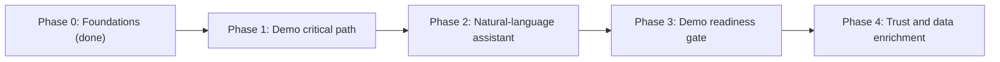

# Feature roadmap (UC4 Breeder's Desk)

Phased, priority-ordered list of the features that cover the hackathon use case
(`gendd/specs/uc4-use-case.md`), from what is already implemented to "demo ready". Scope ends at demo
readiness: conversational channels (WhatsApp, voice), authentication hardening, deployment beyond `stg`
and Cropwise packaging are out of this roadmap.

## How to read and use this file

- A feature is a user-visible or system capability that one agent session can deliver and verify end
  to end.
- Setup, installs, tests, lint and pull requests are never standalone features. They are checklist
  items inside the feature that needs them.
- Each feature has 5 to 9 checklist items. More than that means the feature must be split; fewer than
  5 means it should be merged into a neighbour.
- Work the phases in order, and the features inside a phase in priority order. A feature starts only
  when everything in its "Depends on" line is done.
- Before starting a feature, turn it into a story that passes `gendd/definition-of-ready.md` and save
  it in `gendd/tickets/` (then copy it to Trello). The checklist below is the scope, not the acceptance
  criteria.
- When a pull request completes checklist items, tick them and update the feature's Status in the same
  pull request.
- Every feature must respect the use case's non-negotiables: the breeder makes the final call, every
  colour shows its reason, and the product is an assistant, not a replacement
  (`context/architecture.md`, "Architectural invariants").

## Feature template

```markdown
### F<phase>.<n> <Feature name>
- Status: not started | in progress | done
- Priority: <n> of <total> in Phase <phase>
- Depends on: <feature ids or "none">
- Goal: <one or two sentences, from the breeder's or the team's perspective>
- Evidence / pointers: <files and doc sections>
- Checklist:
  - [ ] <item>
- Done when: <one line tied to the use case>
```

## Phases



| Phase | Features | Status |
|---|---|---|
| 0. Foundations | F0.1 - F0.4 | done |
| 1. Demo critical path | F1.1 - F1.4 | not started |
| 2. Natural-language assistant | F2.1 | not started |
| 3. Demo readiness gate | F3.1 | not started |
| 4. Trust and data enrichment | F4.1 - F4.4 | not started |

Phase 3 comes before Phase 4 on purpose: the demo must be stable before extras are added. After each
Phase 4 feature, re-run the F3.1 checklist.

---

## Phase 0 - Foundations (implemented)

### F0.1 Monorepo scaffold and team conventions
- Status: done
- Priority: 1 of 4 in Phase 0
- Depends on: none
- Goal: The team can install, run and lint the frontend and backend from one repo, following shared
  rules, and agents can load the project context.
- Evidence / pointers: `package.json`, `apps/*/package.json`, `apps/*/eslint.config.js`,
  `.github/workflows/lint.yml`, `.cursor/rules/`, `apps/intersfrontend/src/pages/LandingPage.jsx`,
  `apps/intersbackend/src/index.js`, `context/`, `agents/`, `gendd/`.
- Checklist:
  - [x] npm workspaces for `apps/intersfrontend` (React 18 + Vite) and `apps/intersbackend` (Express)
  - [x] Root scripts `dev:frontend`, `dev:backend`, `lint`
  - [x] ESLint flat config per app; lint runs on every pull request to `dev`, `stg`, `main`
  - [x] Team rules in `.cursor/rules/` (style, naming, React, Express, API contract, testability, constants)
  - [x] Constants folders in both apps (`src/constants/`)
  - [x] Landing page that calls `GET /health` and shows checking / up / unhealthy / unreachable
  - [x] GenDD configuration, Context Pack and role playbooks
- Done when: a new teammate can run both apps and pass lint using only `README.md`. (Met.)

### F0.2 Data ingestion and unification
- Status: done
- Priority: 2 of 4 in Phase 0
- Depends on: none
- Goal: All UC4 mock sources, plus documents, end up in one canonical model with known data problems
  reported instead of hidden.
- Evidence / pointers: `services/data-engine/src/data_engine/ingest.py`, `documents/`, `detect.py`,
  `profile.py`, `canonical.py`, `quality.py`, `config/sources.yaml`, `data/synthetic/uc4/`.
- Checklist:
  - [x] Read CSV / TSV / XLSX / JSON / Parquet tables
  - [x] Read documents (native and scanned PDF, images, DOCX, PPTX, HTML), text layer first and OCR only when needed
  - [x] Route each table to a source by header signature; unknown shapes returned as `UNKNOWN`
  - [x] Entropy-based renormalization that only drops zero-information columns
  - [x] Canonical star-schema model keyed by material and trial
  - [x] Data-quality issues with root cause, fix status and provenance; source files never modified
  - [x] Schema-drift detection against the 2026-09-28 archive drop
- Done when: the four mock sources are unified and every data issue is listed with its cause. (Met.)

### F0.3 Deterministic red / amber / green triage with evidence
- Status: done
- Priority: 3 of 4 in Phase 0
- Depends on: F0.2
- Goal: Every candidate gets a colour and a one-line reason backed by cited evidence, decided by
  readable rules rather than by a model.
- Evidence / pointers: `services/data-engine/config/rules.yaml`, `src/data_engine/rules.py`,
  `spectral.py`, `calibrate.py`, `evaluate.py`, `services/data-engine/docs/FINDINGS.md`,
  `services/data-engine/README.md` ("Results", "Honest limits").
- Checklist:
  - [x] Versioned rules and thresholds in `config/rules.yaml` (`SYNTH_V1_RECON_2026-09-30`, `UC4_MATERIAL_V0`)
  - [x] Trial verdicts with 72/72 parity against the official logic
  - [x] Candidate colour, reason and evidence items (`rule`, `field`, `value`, `threshold`, `statement`)
  - [x] Root-cause analysis for mismatches and "ambiguous" / "not explained" flags
  - [x] Spectral layer for atypical and similar candidates
  - [x] Calibrated ambiguity model, ROC versus baselines and Bayes ceiling
  - [x] Reproducible evaluation report (`python -m data_engine.evaluate`)
- Done when: each of the 150 candidates has a colour and a stated reason. (Met: 54 red, 71 amber, 25 green.)

### F0.4 Engine service interfaces and override audit log
- Status: done
- Priority: 4 of 4 in Phase 0
- Depends on: F0.3
- Goal: Other components (Express, Claude, MCP clients) can consume the engine without touching its
  internals, and breeder overrides are recorded.
- Evidence / pointers: `services/data-engine/src/data_engine/api.py`, `agent_tools.py`,
  `mcp_server.py`, `audit.py`, `telemetry.py`, `diagnostics.py`, `services/data-engine/tests/`,
  `services/data-engine/clients/node/`, `services/data-engine/docs/CONTRACTS.md`, `INTEGRATION.md`.
- Checklist:
  - [x] FastAPI REST API with the team error contract (`{"error": {"code", "message", "field"}}`)
  - [x] 9 Claude tool definitions and a system prompt served by `GET /tools`, executed by `POST /tools/{name}`
  - [x] MCP server (stdio) exposing the same tools
  - [x] Append-only override log; `engine_colour` never changed; no override tool for the agent
  - [x] Telemetry and diagnostics per run saved as JSON
  - [x] pytest suite (unit and API-level tests)
  - [x] Node client and Express route / agent-loop examples ready to copy into `apps/intersbackend`
- Done when: the engine can be called over REST and MCP, and an override is logged without changing
  the engine's colour. (Met.)

---

## Phase 1 - Demo critical path

### F1.1 Express to data engine integration
- Status: not started
- Priority: 1 of 4 in Phase 1
- Depends on: F0.4
- Goal: The frontend can reach all breeder data through the Express backend, with the engine's errors
  and numbers passed through unchanged.
- Evidence / pointers: `services/data-engine/docs/INTEGRATION.md` section 2,
  `services/data-engine/clients/node/`, `apps/intersbackend/src/index.js`, `context/backend-development.md`,
  `agents/backend-dev.md`.
- Checklist:
  - [ ] Copy `clients/node/constants.js` into `apps/intersbackend/src/constants/` and `dataEngineClient.js` into `apps/intersbackend/src/services/`
  - [ ] Mount the breeder router at `/api/breeder` with `express.json({ limit: '25mb' })`: candidates, candidate detail, trial, search, override reasons, overrides, baseline, quality, documents (leave `/chat` for F2.1)
  - [ ] Add `DATA_ENGINE_URL` to `apps/intersbackend/.env.example` and document running the engine alongside Express
  - [ ] `GET /health` reports whether the data engine is reachable, keeping `{ healthy: ... }` accurate
  - [ ] Engine errors forwarded in the team shape; 502 `DATA_ENGINE_UNAVAILABLE` when the engine is down
  - [ ] Choose a backend test framework with a mentor, record it in `gendd/adr/`, and add a `test` script
  - [ ] Route tests with a mocked engine client (success, 404 forwarded, engine down)
  - [ ] `npm run lint` passes
- Done when: `GET /api/breeder/candidates` on port 3000 returns the engine's triage table.

### F1.2 Candidate triage table
- Status: not started
- Priority: 2 of 4 in Phase 1
- Depends on: F1.1
- Goal: The breeder opens the app and sees every candidate with its colour and a one-line reason,
  sorted so the ones that need attention come first.
- Evidence / pointers: `services/data-engine/docs/INTEGRATION.md` section 6, `CONTRACTS.md` ("Output:
  candidate row"), `context/frontend-development.md`, `agents/frontend-dev.md`.
- Checklist:
  - [ ] Replace or extend the landing page with a triage page that fetches `GET /api/breeder/candidates`
  - [ ] Each row shows candidate id, colour, one-line reason, number of trials and fails, and the `ambiguous_trials` / `atypical` flags
  - [ ] Filter by colour and a default order that puts red and ambiguous candidates first
  - [ ] Loading, empty and error states visible in the UI, with `data-testid`s on rows, filters and status messages
  - [ ] Path constants and UI strings in `src/constants/`; a reusable colour badge in `src/components/`
  - [ ] Choose a frontend test framework with a mentor, record it in `gendd/adr/`, and add a `test` script
  - [ ] Component tests for loading, empty, error and populated states
- Done when: the breeder can see all 150 candidates with colour and reason and filter to the red ones.

### F1.3 Candidate evidence card
- Status: not started
- Priority: 3 of 4 in Phase 1
- Depends on: F1.2
- Goal: Clicking a candidate shows why it got its colour, with evidence the breeder can check and
  challenge.
- Evidence / pointers: `services/data-engine/docs/INTEGRATION.md` section 6, `CONTRACTS.md` ("Output:
  evidence item"), engine endpoints `GET /candidates/{id}` and `GET /candidates/{id}/lineage`.
- Checklist:
  - [ ] Detail view opened from a table row, fetching `GET /api/breeder/candidates/:id`
  - [ ] Header with colour, one-line reason, verdict and rule version
  - [ ] Evidence list using `evidence[].statement` exactly as returned (no recomputed numbers)
  - [ ] Trials list with `explained_by_data` and `ambiguous` flags, and data gaps (`data_gaps`) shown as such
  - [ ] Lineage section (add `GET /api/breeder/candidates/:id/lineage` to Express), including "why parents are unavailable"
  - [ ] Loading, not-found and error states with `data-testid`s
  - [ ] Tests asserting that a colour is never rendered without its reason
- Done when: for a flagged candidate, the breeder can read a one-line explanation and the evidence behind it.

### F1.4 Breeder override flow
- Status: not started
- Priority: 4 of 4 in Phase 1
- Depends on: F1.3
- Goal: The breeder can disagree with a colour, say why, and see that the decision was recorded
  without the engine's recommendation being erased.
- Evidence / pointers: `services/data-engine/src/data_engine/audit.py` (reason codes, validation),
  `CONTRACTS.md` ("Override"), `services/data-engine/docs/INTEGRATION.md` sections 3 and 6.
- Checklist:
  - [ ] Override form on the evidence card: new colour, reason from `GET /api/breeder/override-reasons`, comment (required for `OTHER`), breeder name
  - [ ] Submit with `POST /api/breeder/overrides`; show validation errors from the `field` in the error response
  - [ ] Table and card show `engine_colour` next to `colour` whenever `overridden` is true
  - [ ] Override history for the candidate (add `GET /api/breeder/overrides` to Express) with who, when, reason and original colour
  - [ ] The UI copy frames the colour as a recommendation and the override as the breeder's decision
  - [ ] Tests: override accepted, `OTHER` without comment rejected, engine colour unchanged after override
- Done when: the use case's demo-ready definition is met - a flagged candidate with a one-line
  explanation that the breeder challenges and overrides, and the override is logged.

---

## Phase 2 - Natural-language assistant

### F2.1 Breeder assistant chat
- Status: not started
- Priority: 1 of 1 in Phase 2
- Depends on: F1.1 (F1.3 recommended, so answers can link to the evidence card)
- Goal: The breeder asks questions in their own language ("which lines should I look at first?") and
  gets answers that cite the engine's values and remind them that they decide.
- Evidence / pointers: `services/data-engine/clients/node/agentLoop.example.js`,
  `breederRoutes.example.js` (`/chat`), `services/data-engine/docs/INTEGRATION.md` section 3,
  `services/data-engine/src/data_engine/agent_tools.py` (`SYSTEM_PROMPT`).
- Checklist:
  - [ ] Add `@anthropic-ai/sdk` to `apps/intersbackend` with mentor approval; `ANTHROPIC_API_KEY` and `ANTHROPIC_MODEL` only in `.env` and documented in `.env.example` without values
  - [ ] Wire the agent loop and `POST /api/breeder/chat` (validates `question`, caps rounds with `MAX_TOOL_ROUNDS`)
  - [ ] Chat panel in the UI with conversation history, a sending state and an error state
  - [ ] Answers render the colour, the one-line reason and the cited evidence, plus the "you decide" reminder from the system prompt
  - [ ] Clear message when the API key is missing or the engine is unreachable, instead of a crash
  - [ ] No override or colour-changing path through the chat (overrides stay in F1.4)
  - [ ] Tests for the route with a mocked Claude client and a mocked engine
- Done when: the breeder asks "which lines are red and why?" and receives a cited answer.

---

## Phase 3 - Demo readiness gate

### F3.1 Demo readiness
- Status: not started
- Priority: 1 of 1 in Phase 3
- Depends on: F1.4, F2.1
- Goal: The demo can be run reliably by anyone on the team, and a broken change is caught before it
  reaches `stg`.
- Evidence / pointers: `gendd/specs/uc4-use-case.md` (success criteria), `.github/workflows/lint.yml`,
  `README.md`, `context/quality-assurance.md`, `context/security.md`, `agents/tech-lead.md`.
- Checklist:
  - [ ] Written demo script: flagged candidate, explanation, breeder challenges it, override logged, question answered in chat
  - [ ] End-to-end test of that script (tool chosen with a mentor and recorded in `gendd/adr/`)
  - [ ] Continuous integration runs the data engine's `pytest -q` and the new frontend and backend tests, not only lint
  - [ ] `npm audit` findings at Medium or above triaged (fixed or recorded with a reason)
  - [ ] Root `README.md` explains how to run all three processes (engine, backend, frontend) and the required `.env` values
  - [ ] Demo data reset: how to clear the override log (`DATA_ENGINE_STATE_DIR`) before a run
  - [ ] Promotion `dev` -> `stg` through a pull request with the demo script passing
- Done when: the demo script passes end to end on a fresh clone and on `stg`.

---

## Phase 4 - Trust and data enrichment

### F4.1 Trust panel
- Status: not started
- Priority: 1 of 4 in Phase 4
- Depends on: F1.1
- Goal: A sceptical breeder can see how well the rules match the official logic, what the known data
  problems are, and what is still pending SME confirmation.
- Evidence / pointers: engine `GET /baseline`, `GET /quality`, `services/data-engine/docs/FINDINGS.md`,
  `services/data-engine/README.md` ("Honest limits").
- Checklist:
  - [ ] Trust page fetching `GET /api/breeder/baseline` and `GET /api/breeder/quality`
  - [ ] Parity with the official verdicts (72/72) and the rule version in force
  - [ ] Rule weights and root causes of mismatches, in plain language
  - [ ] Data-quality issues with status (fixed, proposed, not fixable) and the open SME questions
  - [ ] Visible caveat that the trial rule is a reconstruction pending SME confirmation
  - [ ] Loading and error states with `data-testid`s, and tests for them
- Done when: the breeder can answer "can I trust this?" from one screen.

### F4.2 New data from the UI and global search
- Status: not started
- Priority: 2 of 4 in Phase 4
- Depends on: F1.3
- Goal: The breeder can drop in a new document (PDF, scan, DOCX) and find any id or word across
  candidates, reasons and documents.
- Evidence / pointers: engine `POST /documents/base64`, `GET /documents`, `GET /search`;
  `services/data-engine/docs/INTEGRATION.md` section 5; `CONTRACTS.md` ("Input 1: files").
- Checklist:
  - [ ] Upload control sending the file to `POST /api/breeder/documents` with a size limit shown to the user
  - [ ] Ingestion result shown: accepted source and rows, or rejected with the best-guess detection
  - [ ] Triage table and evidence card refresh after an accepted upload; document evidence appears on the card
  - [ ] Global search box using `GET /api/breeder/search` over ids, reasons and document text
  - [ ] Search results link to the matching candidate or trial
  - [ ] Loading, error and "no results" states with `data-testid`s, and tests for them
- Done when: a document uploaded during the demo shows up as evidence on the right candidate.

### F4.3 Side-by-side candidate comparison
- Status: not started
- Priority: 3 of 4 in Phase 4
- Depends on: F1.3
- Goal: The breeder compares two to four candidates on the same screen before deciding which advances.
- Evidence / pointers: engine `GET /compare?ids=a,b`, `dataEngineClient.js` (`compare`),
  agent tool `compare_candidates`.
- Checklist:
  - [ ] Add `GET /api/breeder/compare` to Express, forwarding `ids`
  - [ ] Select two to four candidates from the triage table
  - [ ] Comparison view with colour, reason and key evidence per candidate, side by side
  - [ ] Same rules as the evidence card: statements quoted as returned, no recomputed numbers
  - [ ] Validation for fewer than two or more than four selections
  - [ ] Loading and error states with `data-testid`s, and tests for them
- Done when: the breeder can compare two flagged candidates and open either one's evidence card.

### F4.4 Override feedback loop
- Status: not started
- Priority: 4 of 4 in Phase 4
- Depends on: F1.4
- Goal: Disagreements between breeders and the engine become input for the SME to refine the rules,
  instead of being lost.
- Evidence / pointers: `services/data-engine/src/data_engine/audit.py` (docstring: "disagreements
  panel"), engine `GET /overrides`, `services/data-engine/config/rules.yaml`.
- Checklist:
  - [ ] Disagreements view listing all overrides: candidate, engine colour, breeder colour, reason code, comment, rule version, who and when
  - [ ] Counts by reason code and by direction (for example red to amber)
  - [ ] Filter by rule version so disagreements with an old rule are not mixed with the current one
  - [ ] Export (CSV) for the SME
  - [ ] Read-only: nothing in this view changes rules or colours
  - [ ] Loading, empty and error states with `data-testid`s, and tests for them
- Done when: the SME can download every disagreement with its reason for the current rule version.

---

## Open questions affecting this roadmap

- Unknown: backend, frontend and end-to-end test frameworks (decided inside F1.1, F1.2 and F3.1, each
  recorded in `gendd/adr/`).
- Unknown: Claude model id for `ANTHROPIC_MODEL` and who owns the API key (F2.1).
- Unknown: whether the demo runs locally or from `stg` (F3.1).
