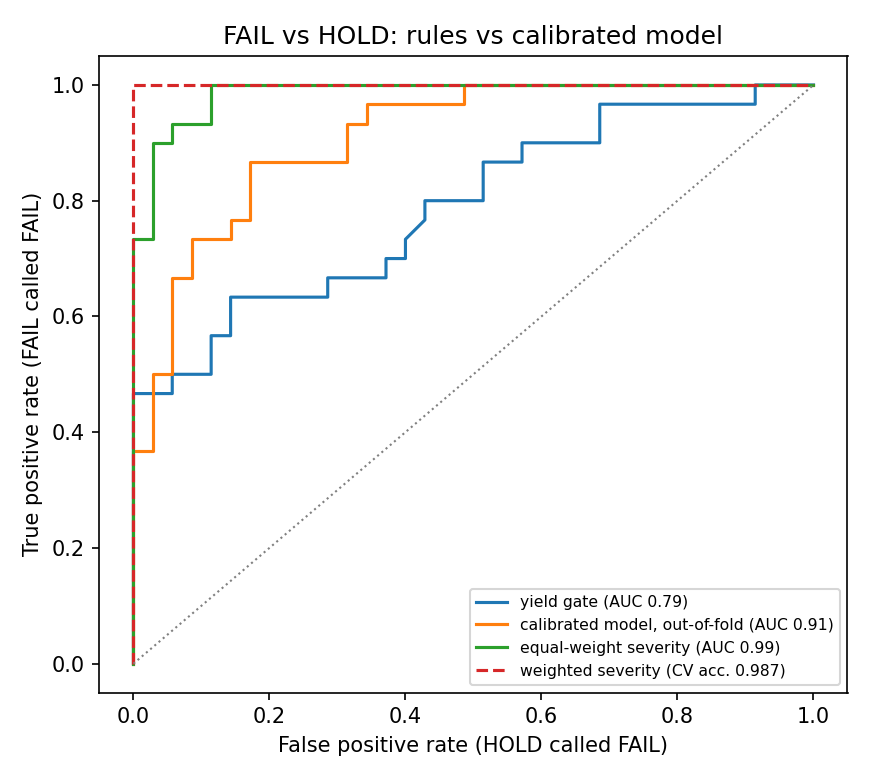

# UC4 Data Engine

Backend service for **Breeder's Desk** (Syngenta × HatchWorks AI Hackathon 2026, Use Case 4: R&D Data Source Unification).

It reads the R&D sources (candidate recommendations, trial-germplasm bridge, trait dictionary, field operations, lab, observations, pedigree, genomics; also the older trial-level drop) **and any document** (native or scanned PDF, image, DOCX, PPTX, XLSX, HTML, text). It unifies them into one canonical model and triages every candidate line **red / amber / green with cited evidence**. The breeder can override any colour, and every override is logged.

**Design rule:** the deterministic engine decides the colour. Statistics and the LLM only qualify or explain it, and the breeder has the last word. The LLM never computes a number; it only cites values this service returns.

```
 CSV / XLSX / JSON exports        documents (PDF, scans, images, DOCX, PPTX, HTML)   records from the Claude API
            │                                  │  text layer first, OCR only if needed     │
            └──── ingest ── detect ── profile ("renormalization") ── canonical ◄───────────┘
                                                                      │
                   quality (issues, root causes, fixes with provenance)
                   rules (decide colour + evidence) ─ spectral (atypical / similar) ─ calibrate (ambiguity, ROC, ceiling)
                                                                      │
                   telemetry + diagnostics (time, CPU, RAM, numerical error, integrity, drift, topology) → runs/*.json
                                                                      │
                   DataEngine ── REST API ── agent tools / MCP server ── Express ── UI
```

## Quick start

```bash
cd services/data-engine
python -m venv .venv && source .venv/bin/activate        # Windows: .venv\Scripts\activate
pip install -r requirements.txt && pip install -e .

# Data: the integrated V2 drop lives in <repo>/data/synthetic/uc4_v2 (default); override with DATA_ENGINE_DATA_DIR.
# The 29-Sep drop (data/synthetic/uc4) is deprecated and kept as the fixture of the trial-level tests.
python -m data_engine.evaluate --out report.json
pytest -q                                                  # 100+ tests
uvicorn data_engine.api:app --port 8001                    # REST API, interactive docs at /docs
python -m data_engine.mcp_server                           # MCP server (stdio) for Claude Desktop / Cursor
```

Optional native back-ends: `python -m data_engine.accel.build` compiles the multithreaded C++ kNN kernel (needs any C++17 compiler). It also compiles the Poppler + Tesseract document tool when their dev packages are installed. For Julia: `pip install juliacall`, then `julia> ] add PDFIO`. All of them are optional, auto-detected, and fall back to Python.

OCR needs the Tesseract binary. On Windows use the UB Mannheim installer and add Spanish; on Linux, `apt install tesseract-ocr tesseract-ocr-spa`.

## Results on the integrated V2 drop (2026-10-02, default data)

The official suggestion moved to the candidate level (`candidate_recommendations.SYSTEM_RAG`). The engine reads the 8 root CSVs of the drop (`data/synthetic/uc4_v2/`) and ignores the `[DEPRECATED]` folders.

| What | Result |
|---|---|
| Source detection | 8/8 files routed by header signature (4 new sources: candidate recommendations, trial-germplasm bridge, trait dictionary, field operations) |
| Keys | MATERIAL_GUID (pedigree is the master: 150 candidates + 2 commercial checks), TRAIT_GUID (6 traits), TRIAL_ENTRY_GUID / FIELD_ENTITY_ID (bridge: 72 trials, 1,728 entries). Referential integrity 100 % on 10 reference paths |
| **Parity with the official RAG** | **150/150** (32 green · 53 amber · 65 red), two-tier rule reconstructed from the official reasons; 146/150 reason texts identical, the other 4 differ only in a rounded last digit |
| **Official summary recomputed from the plots** | N trials, usable trials, yield vs checks (ratio of means over usable trials), disease, moisture, germination, fumonisin: **all 150 candidates within rounding** |
| Findings | no V2 trial table (TRIAL_GUIDs match none of the deprecated table: no location/year); BREEDER_DECISION empty for 150; 2 lines genotyped only; 2 commercial checks; operations: 11 delayed, 5 missed (irrigation, which excludes the trial for 30 candidates), 140 recorded on paper / PDF / WhatsApp |

Details: [`docs/FINDINGS.md`](docs/FINDINGS.md), section 0.

## Results on the 29-Sep drop (deprecated; `python -m data_engine.evaluate` with `DATA_ENGINE_DATA_DIR=<repo>/data/synthetic/uc4`)

| What | Result |
|---|---|
| Source detection | 7/7 files, signature score 1.0. The 28-Sep schema is also recognised (schema drift) |
| Renormalization | 200 columns → 54 informative. Only zero-entropy columns are dropped, so this is lossless |
| LLM payload per candidate | ~5,200 → ~270 tokens (−95 %) compared with sending the raw rows |
| **Parity with the official verdicts** | **72/72**, weighted-severity rule. PASS is exact |
| Bayes ceiling of any flag-only rule | 60/72: the same flags receive different verdicts |
| FAIL vs HOLD | yield gate AUC 0.79 · calibrated model 0.91 (out-of-fold) · equal-weight severity 0.99 (68/72) · **weighted severity, CV accuracy 0.987 ± 0.035** |
| Weights found | yield 1.00 > disease 0.56 > moisture 0.19 > genomic value 0.08. Only yield and disease are statistically supported |
| Numerical verification | every identity holds to ~1e-15 (machine precision); κ(X) = 5.7 |
| Integrity | 150/150 material keys and 72/72 trial keys preserved |
| Data-quality issues found | 10 issues, 845 records. 4 fixed with provenance, 1 fix proposed, 5 reported as not fixable, with a question for the SME |
| Build time (2 CPUs, 8 GB) | ~2.4 s cold, ~1.2 s incremental (calibration cached by content hash) |
| Candidate triage (v0 proposal) | 54 red · 71 amber · 25 green |



**What the numbers say.** The official pass/fail *flags* cannot explain FAIL vs HOLD, because identical flags get different verdicts. A calibrated model showed that the *size* of each miss matters. That became a readable rule: the weighted sum of relative shortfalls beyond each threshold. With equal weights it explains 68/72 trials. Root-cause analysis showed the 4 misses were all caused by the weighting. A maximum-margin fit of the weights explains 72/72 and holds up out of sample. ML discovers the structure, and a rule a breeder can read decides. Details: [`docs/FINDINGS.md`](docs/FINDINGS.md).

## Layers

| Module | What it does | Why this technique |
|---|---|---|
| `system` | Probes usable CPUs (affinity, cgroup quota), physical cores and RAM (cgroup limit) | Every resource decision derives from one hardware profile |
| `parallel` | Picks inline / threads / processes from an Amdahl + memory model | Parallelises only when the model predicts ≥ 20 % gain and RAM allows it |
| `ingest`, `documents` | Tables and documents. PDF text layer first, OCR only on pages without text; C++ / Julia / Python back-ends | Exact text is never degraded by OCR; backend choice is recorded |
| `relevance` | Gate for uploads: known ids / table signatures first, then a lexicon + char n-gram contrast model (logistic, nested-LOO reported) | Off-topic files never reach the LLM or the evidence; doubtful ones go to a person |
| `detect`, `profile` | Header signatures; Shannon entropy per column | Deterministic routing; lossless removal of zero-information columns |
| `patterns` | Character → integer encoding, ID grammar, combinatorics, counter gaps, fact extraction | Finds IDs in free text, validates formats, detects missing records |
| `canonical`, `quality` | Key aliases → star schema. Issues with root cause, fix status and provenance | Never overwrites the system of record; every fix is reversible |
| `rules` | Versioned thresholds and weights from `config/rules.yaml` → colour + evidence | Breeders and the SME can read and change them without code |
| `encode`, `spectral` | Symmetry-group encodings; SVD with a certified truncation error; whitening; T² with an exact Beta limit | Error bounds are exact; the algebra is diagonal; no inverses are formed |
| `calibrate` | Bayes ceiling, leak-free CV model, max-margin weights, ROC, overtraining check | Honest baseline; human-in-the-loop grounded in real ambiguity |
| `telemetry`, `diagnostics` | Per-stage time/CPU/RAM; numerical checks; hashes; PSI drift; H0 persistent homology | Every run is measured and verified, then saved as JSON |
| `accel` | Multithreaded C++ / Julia kNN, NumPy chunks sized to the RAM budget | Streaming O(n·k) memory for very large candidate sets |
| `store` | DuckDB snapshot + eigenbasis `.npz`; read-only SQL; search | Queryable, reloadable, diffable state |
| `agent_tools`, `mcp_server`, `api` | Claude tool schemas + dispatcher, MCP server, REST with the team error contract | Teammates plug in the Claude API without touching the internals |

The mathematical justification is in [`docs/DESIGN.md`](docs/DESIGN.md), the JSON contracts in [`docs/CONTRACTS.md`](docs/CONTRACTS.md), and the step-by-step for the API/agent/frontend teammates in [`docs/INTEGRATION.md`](docs/INTEGRATION.md).

## Environment variables

| Variable | Default | Purpose |
|---|---|---|
| `DATA_ENGINE_DATA_DIR` | `<repo>/data/synthetic/uc4` | input directory (tables + documents) |
| `DATA_ENGINE_STATE_DIR` | `services/data-engine/.state` | overrides log, `runs/*.json`, snapshot |
| `DATA_ENGINE_LIB_DIR` | `services/data-engine/.state` | compiled C++ back-ends |
| `DATA_ENGINE_MEMORY_FRACTION` | `0.5` | share of available RAM the engine may plan to use |
| `DATA_ENGINE_TRACEMALLOC` | `0` | `1` = exact Python-heap profiling per stage (~3-4x slower build) |
| `DATA_ENGINE_DOC_BACKENDS` | `cpp,julia,python,tika,textract` | document back-end preference order |
| `DATA_ENGINE_OCR_LANG` | `eng+spa` when installed | Tesseract languages |
| `DATA_ENGINE_ENABLE_JULIA` | unset | `1` forces the Julia back-ends on (otherwise used only if Julia is found) |
| `DATA_ENGINE_DENSE_LIMIT` | `25000000` | n·m pairs above which kNN switches to C++/Julia |

## Honest limits

- The trial rule is a **reconstruction** (`SYNTH_V1_RECON`) pending SME confirmation. The weights are fitted, and the margin to the cut is thin (4e-5), so one trial sits on the boundary. The candidate rule (`UC4_MATERIAL_V0`) is **our proposal**.
- In the mocks every candidate was tested in a single location-year, so stability across environments cannot be assessed. The engine reports this instead of hiding it.
- The mock features are nearly uncorrelated, so spectral compression is modest (16 → 13 components at 95 %). Real, correlated trait data compresses more. The canonical tables are always kept, so compression never loses data.
- Some parts could not be run in the build environment and fall back automatically: the Julia back-ends (Julia download blocked there), Apache Tika (needs its server jar) and textract. The Python and C++ paths are tested (90+ tests).
- The relevance gate is trained on 48 short examples. It is meant to stop obviously off-topic files and to send borderline ones to a person, not to judge scientific relevance. Add examples to `config/relevance.yaml` when it errs.
- The document text extractor reads values that are written next to known field names (English/Spanish). It does not interpret prose, and document facts never change a colour.

## Attribution

The ROC / overtraining-check evaluation pattern follows the ATLAS Open Data machine-learning tutorials (CERN). It is reimplemented here with scikit-learn; no code or data from those projects is included.
